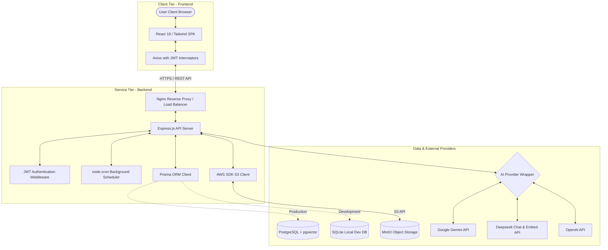
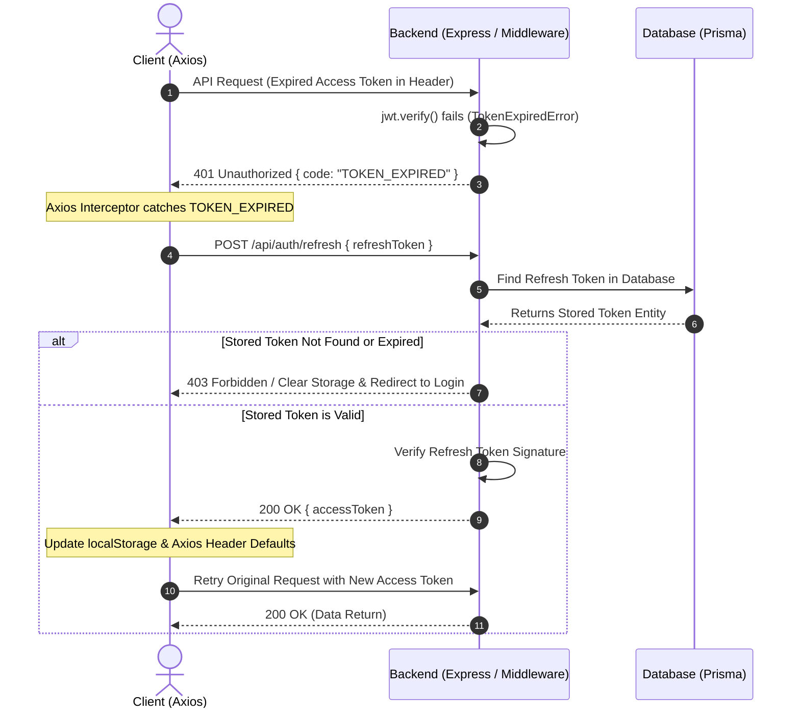
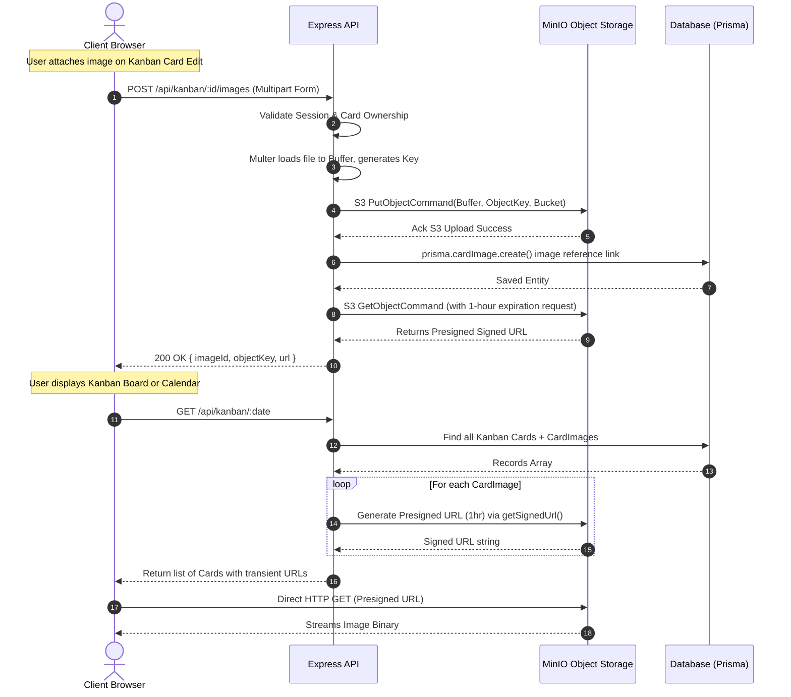
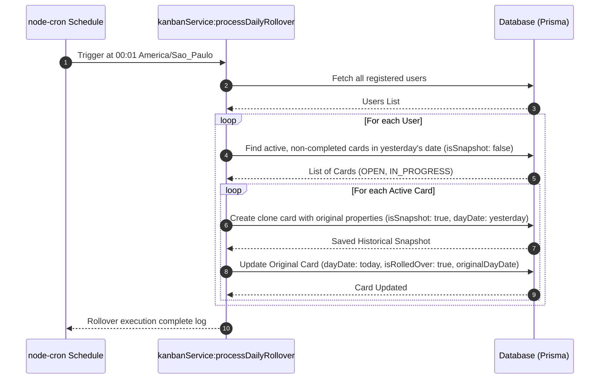
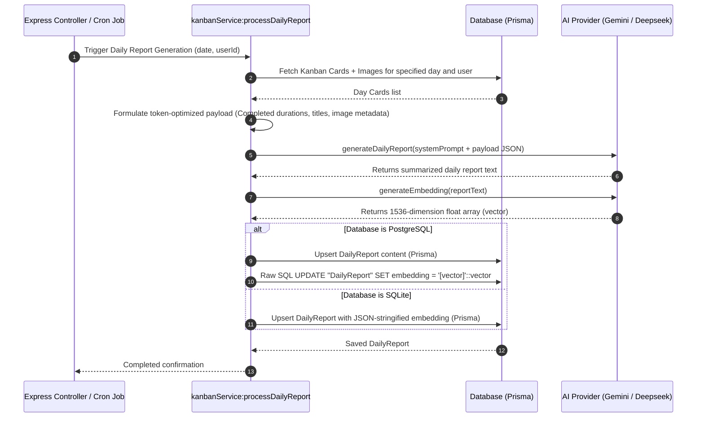

# 📅 KalendAI: System Architecture Documentation

This document provides a comprehensive technical overview of the architectural design, patterns, components, security mechanisms, and data flows implemented in the **KalendAI** platform.

---

## 🧭 1. Architectural Overview

KalendAI is built on a clean, modern **Full-Stack Single Page Application (SPA)** plus **RESTful API API-first** architecture. The application is designed to be highly modular, lightweight, secure, and ready for deployment using Docker container virtualization. 

The architecture bridges standard time-blocking calendar routines with a **Daily Kanban Board** layout, enriched with AI-powered automatic report summarization, object-storage evidence upload, and vector embeddings for semantic search capabilities.

### 🌐 System Overview Diagram



---

## 🏗️ 2. Architectural Components

The application is segregated into well-defined responsibilities, making maintenance, feature enhancement, and deployment highly predictable.

### 🖥️ 2.1. Frontend Tier (React SPA)
The frontend is developed as a fast, client-side SPA leveraging **React 18** with **Vite** for optimized build performance.
- **Client-Side Routing**: Handled cleanly by `react-router-dom` v6.
- **Drag-and-Drop Kanban Engine**: Abstractions implemented using `@dnd-kit` (including `DndContext`, `SortableContext`, and specific collision strategies) to facilitate smooth, responsive, real-time reordering of cards across columns (`OPEN`, `IN_PROGRESS`, `DONE`).
- **Styling & UI**: Formatted entirely with **Tailwind CSS** and **Lucide React** icons. It incorporates high-fidelity transitions, bento-grid metric components, custom responsive charts, and user lightbox modals.
- **API Client Connection**: Uses **Axios** with global interceptors handling automatic Bearer token insertions and silent token renewal (JWT recovery).

### ⚙️ 2.2. Backend Tier (Node.js REST API)
The backend is a stateless RESTful service developed with **TypeScript**, **Node.js**, and **Express**.
- **Controllers & Routing**: Routing modules under `src/routes/` cleanly map logical resource endpoints (`/auth`, `/kanban`, `/reports`, `/dashboard`).
- **Background Jobs (node-cron)**: Manages automated daily tasks aligned to the São Paulo timezone (`America/Sao_Paulo`), ensuring proper data roll-forward and report generation schedules.
- **Prisma Client Engine**: Serves as the database abstraction Layer, enabling fast migrations, robust type-safety, and seamless switching between local and production databases.

### 📦 2.3. Storage Infrastructure
1. **Relational Database**: 
   - *Development*: A lightweight SQLite file-based database.
   - *Production*: A standard PostgreSQL database with the `pgvector` extension enabled.
2. **Object Storage Service**: A self-hosted or managed **MinIO** cluster (fully AWS S3 API compliant) designed to house attached media evidence uploaded by users onto Kanban tasks securely.

### 🤖 2.4. Modular AI Provider Wrapper
To avoid vendor lock-in, KalendAI implements an abstraction layer in `aiService.ts` and `aiProvider.ts` supporting three major AI providers out of the box:
- **Gemini**: Communicates natively using the modern `@google/genai` SDK.
- **Deepseek**: Communicates via standard raw HTTP POST payloads directed at the Deepseek chat/completions and embedding endpoints.
- **OpenAI**: Easily swappable using standard OpenAI API endpoint configurations.

---

## 🔄 3. Key Data & Component Flows

This section details the vital operational flows that dictate KalendAI's core capabilities.

### 🔐 3.1. Authentication and Token Refresh Flow
The system enforces a dual-token JWT mechanism to isolate session lifetimes securely. Access tokens are transient (e.g., 15 minutes) and refresh tokens are long-lived (7 days) and validated against database storage.



---

### 🖼️ 3.2. Secure Media Evidence Upload & Presigned Retrieval Flow
To guarantee media file safety, direct access to the S3 bucket is restricted. Files are uploaded via standard Multipart streams to the backend, pushed to MinIO privately, and retrieved strictly via ephemeral presigned URLs.



---

### 🔄 3.3. Daily Rollover Execution Job
Every day at `00:01` (São Paulo Time), the system performs a crucial rollover migration to ensure users start each day with a clean slate while keeping an immutable historical record.



---

### 🤖 3.4. AI Daily Summarization & Semantic Vector Embeddings
At `18:00` daily (or when manually prompted), KalendAI constructs a highly optimized textual summary of the day's achievements, sends it to the AI engine, and maps the output into vector spaces using the configured LLM API.



---

## 🔒 4. Security Architecture & Threat Mitigations

KalendAI is architected with multiple security controls across all tiers to protect user information and file integrity.

### 🛡️ 4.1. Network & System Security
- **Security Headers (Helmet)**: Express utilizes `helmet()` middlewares to automatically inject HTTP headers that restrict malicious script execution, frame hijackings (`X-Frame-Options`), and prevent MIME sniffing.
- **Cross-Origin Resource Sharing (CORS)**: Access is constrained to valid origin paths, mitigating Cross-Origin Request exploits.
- **Nginx Reverse Proxy**: Direct client calls in production are terminated by Nginx, routing traffic internally through isolated docker bridges to block unsolicited port access.

### 🔑 4.2. Session & User Access Safety
- **Cryptographic Password Salting**: User password storage utilizes `bcryptjs` with `10` salt rounds, protecting stored hashes from brute force or rainbow table lookup procedures.
- **Access vs Refresh Separation**: In the event that a transient Access Token is compromised, its `15m` short expiration duration bounds the exposure window. Refresh tokens are secured under standard cryptographic tokens saved safely in database tables.
- **Strict Query Scoping**: Every CRUD action on Kanban cards, image management, reports, or profile edits is implicitly filtered by `userId = req.user.userId`. It is architecturally impossible for a tenant to view, delete, or manipulate another user's tasks.

### 🪣 4.3. Object Storage Hardening
- **Private Buckets**: MinIO is configured to start with fully private visibility policies. There are no public upload read/write rules.
- **MinIO Bootstrap Provisioning**: During server bootstrap, bucket creation checks run dynamically. Bucket access controls prevent direct path traverse attempts.
- **Pre-signed Access Expiry**: Access links sent to the React Frontend expire precisely after `3600 seconds` (1 hour). This mitigates long-term link leakages or direct unauthorized scraping.

---

## 📈 5. Scalability & Extensibility

1. **pgvector RAG Architecture**: Storing semantic dimensions directly in PostgreSQL prepares the platform for retrieval-augmented generation (RAG). Future interfaces can instantly leverage semantic matching to answer queries like "What projects was I struggling with last month?" using standard vector distance searches:
   ```sql
   SELECT content, date FROM "DailyReport" 
   ORDER BY embedding <=> '[query_vector]'::vector LIMIT 5;
   ```
2. **Stateless Middleware REST API**: The API tier does not rely on local sessions. Multiple instances of the backend container can scale out behind a round-robin load balancer.
3. **Database Independence**: The implementation of Prisma enables switching databases from development configurations to global cloud-native database services without changing core application queries.
