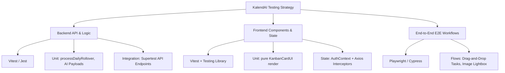

# 🧪 Testing Framework & Verification Plan

This document details the testing architecture, validation scripts, test coverage, and development-stage verification processes for the **KalendAI** monorepo. It also presents a blueprint for implementing automated test suites across both workspaces.

---

## 🔍 1. Current Testing Status

An analysis of the KalendAI repository indicates the following:

### ⚠️ Testing Coverage: 0% (No Automated Testing Suites)
*   **No Spec Files**: There are no automated unit, integration, or end-to-end (E2E) test files (matching `*.test.ts`, `*.spec.ts`, `*.test.tsx`, or `*.spec.tsx`) inside the `frontend/` or `backend/` directories.
*   **No Testing Libraries**: Neither the root `package.json` nor the workspaces (`frontend/package.json`, `backend/package.json`) define dependencies on testing frameworks such as **Jest**, **Vitest**, **Mocha/Chai**, **Cypress**, or **Playwright**.
*   **No Test Commands**: There is no `"test"` command configured inside any of the `package.json` files' scripts.

---

## 🛠️ 2. Developer Verification & Manual Testing Workflows

Although automated testing is not yet configured, the codebase is designed with robust local verification and fail-safe manual testing mechanisms.

### 🔄 A. Database Mocking & Local Dev Fallback State
To let developers test the UI, drag-and-drop mechanics, and date calculations without forcing a local PostgreSQL instance:
*   **Connection Interception**: Key backend routes (e.g. `GET /api/kanban/:date` and `POST /api/kanban`) trap database initialization errors (`PrismaClientInitializationError` or error codes starting with `P`).
*   **In-Memory Mock State**: Upon catching a database error, the endpoints automatically switch to an in-memory mocked state array (`global.mockCards`). This enables visual layout verification, creation, and updating of mock Kanban tasks directly inside a browser without database drivers.

### 📝 B. Structured Boot and Cron Logging
Operational lifecycle tasks are instrumented with explicit console logs using emojis to assist developers in tracking task executions in development terminals:
*   `✅ Admin user created successfully`: Confirms successful DB seed and hash validation.
*   `🚀 Backend server running on port 3001`: Confirms Express server bootstrapping.
*   `Iniciando rollover diário...` / `Rollover concluído.`: Traced messages showing cron rollover lifecycle state.
*   `Iniciando geração de relatório AI...` / `Falha ao gerar o relatorio...`: Identifies AI model calls and API key setups.

### 🌱 C. Idempotent Data Seeding
*   **File**: `backend/seed.ts` (also embedded as `seedAdmin` in `server.ts`).
*   **Function**: Bootstraps the default Administrator account if it does not exist in the database, verifying password hashing and default role permissions.

---

## 🚀 3. Proposed Automated Testing Strategy

To elevate code quality and reliability, the following testing architecture is recommended for the KalendAI monorepo:



### ⚙️ A. Backend Automated Testing Blueprint

#### 1. Framework Recommendation: **Vitest**
*   *Rationale*: Out-of-the-box support for TypeScript ESM compilation, faster execution, and compatibility with frontend tooling.

#### 2. Key Areas to Cover
*   **Rollover Logic (`backend/src/services/kanbanService.ts`)**:
    *   Test that unresolved cards are successfully cloned into snapshot cards for yesterday, and original cards are moved to today.
    *   Verify that attachments/images reference keys are duplicated to the snapshot.
*   **AI Payload Formatting (`backend/src/routes/kanbanRoutes.ts`)**:
    *   Verify the mathematical calculations formatting total completion durations (e.g. converting `createdAt` vs `completedAt` to `X hours and Y minutes`).
*   **Authentication & Access Token Interception (`backend/src/middleware/authMiddleware.ts`)**:
    *   Validate that routes return `401` for missing headers, and properly validate JWT claims.

#### 3. Recommended DevDependencies (`backend/package.json`)
```json
"devDependencies": {
  "vitest": "^1.4.0",
  "supertest": "^6.3.4",
  "@types/supertest": "^6.0.2"
}
```

---

### ✨ B. Frontend Automated Testing Blueprint

#### 1. Framework Recommendation: **Vitest + React Testing Library**
*   *Rationale*: Light speed tests that execute inside a fast simulated browser environment (Happy DOM or JSDOM).

#### 2. Key Areas to Cover
*   **State Management & Interceptors (`frontend/src/services/api.ts`)**:
    *   Mock Axios failures and test that expired access tokens trigger a call to `/auth/refresh`, rewrite local storage caches, and retry original tasks seamlessly.
*   **Isolated Component Rendering (`frontend/src/components/SortableKanbanCard.tsx`)**:
    *   Since layout rendering is separated (`KanbanCardUI`), unit tests can verify title rendering, description limits, and custom tags without mocking drag-and-drop context wrappers.
*   **Calendar State Transitions (`frontend/src/pages/Calendar.tsx`)**:
    *   Verify month navigation and date rendering constraints (e.g., locking out weekend cards when `disableWeekends` is active).

#### 3. Recommended DevDependencies (`frontend/package.json`)
```json
"devDependencies": {
  "vitest": "^1.4.0",
  "@testing-library/react": "^14.2.1",
  "@testing-library/jest-dom": "^6.4.2",
  "happy-dom": "^13.8.0"
}
```

---

### 🌐 C. End-to-End (E2E) Testing Blueprint

#### 1. Tool Recommendation: **Playwright**
*   *Rationale*: Exceptional cross-browser headless test support, fast drag-and-drop testing utilities, and rich visual trace debugging tools.

#### 2. High-Priority Workflows to Automate
*   **Full Drag-and-Drop Process**:
    *   Simulate a user logging in, creating a task, dragging it from `OPEN` to `IN_PROGRESS` and then to `DONE`, and verifying the completion timer badge displays.
*   **Image Evidence Upload**:
    *   Trigger file upload on a card, verify S3 communication, and check that clicking on the thumbnail triggers the visual Lightbox backdrop correctly.

---

## 📊 4. CI/CD Integration

Once automated test suites are introduced, the deploy workflow (`.github/workflows/deploy.yml`) should be updated to execute checks before packaging Docker containers:

```yaml
# Add to .github/workflows/deploy.yml
jobs:
  test:
    name: Run Test Suites
    runs-on: ubuntu-latest
    steps:
      - uses: actions/checkout@v4
      - uses: actions/setup-node@v4
        with:
          node-version: 20
          cache: 'npm'
      - name: Install dependencies
        run: npm ci
      - name: Run Backend Tests
        run: npm run test --workspace=backend
      - name: Run Frontend Tests
        run: npm run test --workspace=frontend
```
This safeguards production branches from regression bugs, ensuring maximum codebase reliability.
